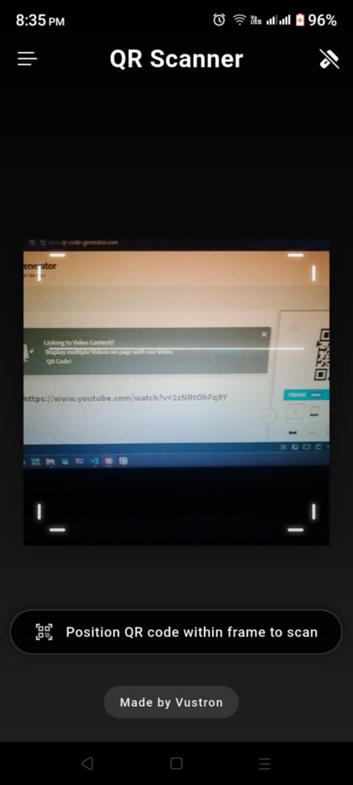
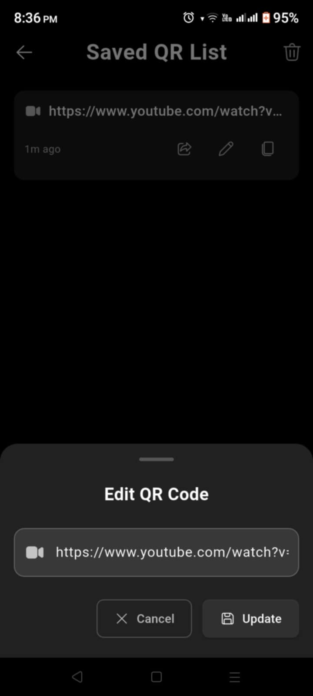
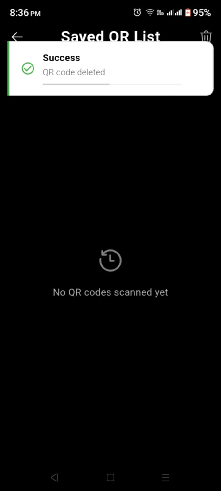
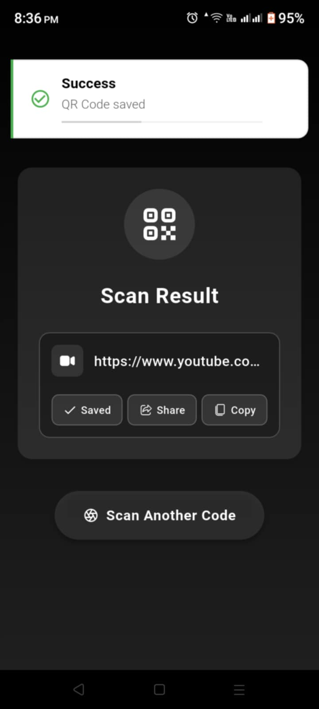

# QR Code Scanner

A modern QR code scanner application built with Flutter that enables real-time QR code scanning, local storage management, and seamless sharing capabilities.

<div align="center">
  <table>
    <tr>
      <td align="center">
        <br/>
        <sub><b>Scanner Screen</b></sub>
      </td>
      <td align="center">
        <br/>
        <sub><b>Share QR Code</b></sub>
      </td>
      <td align="center">
        <br/>
        <sub><b>Saved QR Code List</b></sub>
      </td>
    </tr>
    <tr>
      <td align="center">
        <br/>
        <sub><b>Edit QR Code</b></sub>
      </td>
      <td align="center">
        <br/>
        <sub><b>Delete QR Code</b></sub>
      </td>
      <td align="center">
        <br/>
        <sub><b>Save QR Code</b></sub>
      </td>
    </tr>
  </table>
</div>

## ✨ Features

- 📷 Real-time QR code scanning with auto-focus
- 💾 Local storage for scanned QR codes using SQLite
- 🔄 CRUD operations (Create, Read, Update, Delete)
- 📤 Share QR codes instantly
- 🔦 Flashlight control for low-light scanning
- 📱 Modern UI with smooth animations
- 🔒 No internet required - works offline

## 🛠️ Tech Stack

- **Framework**: Flutter
- **State Management**: Riverpod
- **Database**: SQLite
- **Functional Programming**: FPDart
- **QR Scanning**: Mobile Scanner
- **Architecture**: MVC

## 📦 Key Packages

```yaml
dependencies:
  flutter:
    sdk: flutter
  hooks_riverpod: ^2.4.10
  flutter_hooks: ^0.20.5
  mobile_scanner: ^4.0.0
  sqflite: ^2.3.2
  fpdart: ^1.1.0
  share_plus: ^7.2.1
  path: ^1.9.0
```

## 🚀 Getting Started

### Prerequisites
- Flutter SDK (3.19.0 or higher)
- VS Code or Android Studio
- Android SDK / Xcode
- Git

### Installation

# Clone repository
```bash
git clone https://github.com/Vustron/Flutter-QR-Scanner.git
```

# Navigate to project
```bash
cd qrcode_scanner
```

# Install dependencies
```bash
flutter pub get
```

# Run application
## 💡 Usage
1. Launch application
2. Allow camera permissions
3. Point camera at QR code
4. QR content detected automatically
5. Choose action:
   - Save QR code
   - Share content
   - Copy to clipboard
   - Edit saved codes
   - Delete from history
Edit saved codes

## 🔧 Development
# Run tests
```bash
flutter test
```

# Build release
```bash
flutter build apk --release
```

## 🤝 Contributing

🤝 Contributing
Fork repository
Create feature branch (git checkout -b feature/NewFeature)
Commit changes (git commit -m 'Add NewFeature')
Push to branch (git push origin feature/NewFeature)
Open Pull Request
📄 License
This project is licensed under the MIT License - see the LICENSE file for details.

👨‍💻 Author
Vustron

GitHub: @Vustron
